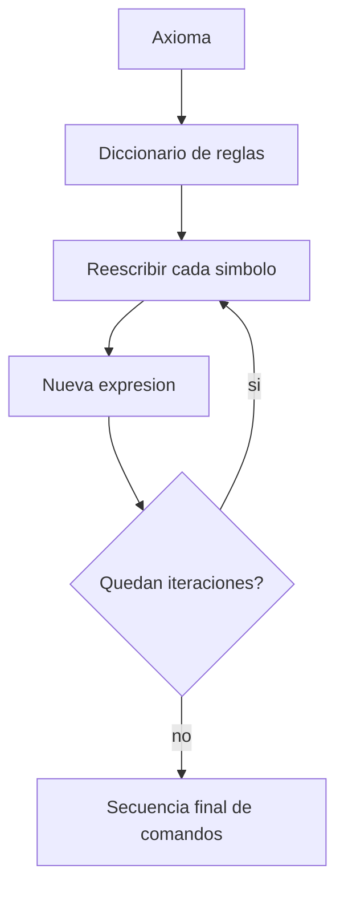
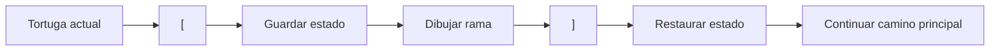

<p align="right">
  <a href="README.md">English</a> | <strong>Espanol</strong>
</p>

# Lindenmayer Systems en Clojure

<div align="center">


</div>

---

Un motor deterministico en Clojure que lee definiciones de Sistemas de Lindenmayer, las expande mediante reglas de reescritura paralela, interpreta la cadena resultante con graficos de tortuga y exporta la geometria generada como SVG.

## Highlights

> Un pipeline funcional compacto para parsear gramaticas formales, transformar estado simbolico y renderizar una salida deterministica.

- **Expansion basada en reglas**: cada iteracion reescribe la expresion completa a partir de un axioma y un mapa de reglas de produccion.
- **Estado de tortuga inmutable**: las operaciones de dibujo transforman mapas de Clojure con coordenadas, direccion, angulo configurado y estado de la pluma.
- **Ramificacion con stack**: `[` y `]` guardan y restauran estados de la tortuga, habilitando estructuras fractales y similares a plantas.
- **Pipeline de generacion SVG**: el interprete registra segmentos, calcula limites, crea un `viewBox` dinamico y escribe un artefacto SVG portable.
- **Ejemplos por recursos**: los archivos `.sl` incluyen sistemas clasicos como curvas de Koch, curva del Dragon, variantes de Sierpinski, curva de Peano, Levy, grillas, arboles y otros patrones fractales.
- **Practica relevante para backend**: parsing, transformacion de datos, procesamiento recursivo, ejecucion deterministica, I/O de archivos y orquestacion por linea de comandos estan separados en funciones pequenas.

---

## Qué es

Este proyecto implementa un procesador pequeno de L-Systems en Clojure.

Un L-System empieza con una cadena inicial llamada **axioma**. En cada iteracion, cada simbolo se reescribe segun un conjunto de reglas de produccion. Despues de varias iteraciones, una definicion simbolica corta puede convertirse en una secuencia de comandos muy grande. Este proyecto interpreta esa secuencia usando graficos de tortuga y genera un SVG como salida.

Aunque el resultado es visual, lo interesante desde lo tecnico es el pipeline de procesamiento:

1. Leer y parsear un archivo de entrada estructurado.
2. Convertir reglas textuales en un diccionario de busqueda.
3. Expandir la expresion recursivamente durante `n` iteraciones.
4. Interpretar la secuencia generada como transiciones de estado.
5. Persistir la geometria vectorial resultante en un archivo SVG.

---

## Por qué L-Systems

Los Sistemas de Lindenmayer son un ejemplo muy claro de como reglas simples pueden producir comportamiento complejo. Se usan para modelar fractales, curvas recursivas y patrones de crecimiento biologico.

Eso los vuelve un buen ejercicio de programacion porque la implementacion debe coordinar varias preocupaciones a la vez: parsing, reescritura simbolica, recursion, modelado de estado, comportamiento de stack, geometria numerica y generacion deterministica de salida.

---

## Capacidades

### Motor de Reescritura Paralela

La expansion principal de expresiones se implementa con `hallar-expresion` y `hallar-expr-aux`.

- La expresion de entrada se procesa simbolo por simbolo.
- Si existe una regla para el simbolo, se reemplaza.
- Si no existe una regla, el simbolo se conserva.
- La nueva expresion se usa como entrada de la siguiente iteracion.

Esto refleja el modelo de L-Systems, donde todos los simbolos se reescriben conceptualmente en paralelo en cada generacion.



### Interprete de Graficos de Tortuga

El motor de dibujo usa una tortuga representada como un mapa inmutable:

```clojure
{:x 0
 :y 0
 :angulo-cons 90
 :angulo-act 90
 :pluma true}
```

Comandos soportados:

| Comando | Comportamiento |
| --- | --- |
| `F`, `G` | Avanza y registra un segmento visible |
| `f`, `g` | Avanza con la pluma levantada |
| `+` | Rota a la derecha segun el angulo configurado |
| `-` | Rota a la izquierda segun el angulo configurado |
| `|` | Invierte la direccion 180 grados |
| `[` | Guarda el estado actual de la tortuga en el stack |
| `]` | Restaura el estado anterior desde el stack |

El interprete recorre la secuencia final de comandos de forma recursiva y acumula un historial de segmentos.

### Estructuras con Ramificacion

La ramificacion se implementa con un stack de estados de tortuga. Esto permite que definiciones de arboles y plantas vuelvan a posiciones anteriores y sigan dibujando desde alli.



### Exportacion SVG

Luego de interpretar la secuencia de comandos, el proyecto escribe elementos SVG de tipo `line` desde el historial de movimientos.

El escritor SVG:

- calcula coordenadas minimas y maximas de todos los segmentos;
- deriva un `viewBox` a partir de esos limites;
- invierte la coordenada Y para el sistema de renderizado SVG;
- agrega cada movimiento como un elemento `<line>`;
- escribe el resultado en la ruta recibida por CLI.

### Formato de Archivo de Entrada

Los archivos de entrada viven en `resources/` y usan un formato textual minimo:

```text
<angulo>
<axioma>
<simbolo> <reemplazo>
<simbolo> <reemplazo>
...
```

Ejemplo de `resources/koch1.sl`:

```text
90
F
F F-F+F+F-F
```

Ejemplo de `resources/arbol1.sl`:

```text
25
X
X F+[[X]-X]-F[-FX]+X
F FF
```

---

## Estructura del Proyecto

```text
.
|-- project.clj
|-- src/
|   `-- algo3_tp2_sistemasl/
|       `-- core.clj
|-- resources/
|   |-- arbol1.sl
|   |-- dragon.sl
|   |-- koch1.sl
|   |-- sier1.sl
|   `-- ...
|-- test/
|   `-- algo3_tp2_sistemasl/
|       `-- core_test.clj
`-- doc/
    `-- intro.md
```

### Componentes Principales

| Area | Funciones | Responsabilidad |
| --- | --- | --- |
| Procesamiento de entrada | `procesar-entrada`, `convertir-reglas-a-diccionario` | Leer archivos `.sl` y parsear reglas |
| Reescritura | `hallar-expresion`, `hallar-expr-aux` | Generar la expresion final del L-System |
| Estado de tortuga | `nueva-tortuga`, `adelante`, `derecha`, `izquierda`, `invertir` | Modelar movimiento y rotacion |
| Ramificacion | `apilar-tortuga`, `desapilar-tortuga` | Guardar y restaurar estado de dibujo |
| Renderizado | `dibujar`, `detectar-movimiento`, `calcular-limites` | Convertir comandos en geometria |
| Salida | `escribir-svg`, `escribir-svg-wrapper` | Escribir markup SVG |
| Entrypoint CLI | `-main` | Conectar entrada, generacion, dibujo y salida |

---

## Primeros Pasos

### Requisitos

- Java JDK 8+
- Leiningen

### Instalacion

```bash
git clone https://github.com/Vityyy/L-Systems.git
cd L-Systems
```

### Ejecucion

La aplicacion espera tres argumentos por linea de comandos:

```bash
lein run <archivo-entrada> <iteraciones> <svg-salida>
```

Ejemplo:

```bash
lein run koch1.sl 4 output.svg
```

El archivo de entrada se busca dentro de `resources/`. El SVG se escribe en la ruta pasada como tercer argumento.

### Ejecutar REPL

```bash
lein repl
```

Ejemplo de uso desde REPL:

```clojure
(require '[algo3-tp2-sistemasl.core :as ls])

(def rules {:F "F-F+F+F-F"})
(def expression (ls/hallar-expresion "F" rules 3))
(def history (ls/wrap-tortuga 90 expression))

(ls/escribir-svg-wrapper history "koch.svg")
```

---

## Sistemas de Ejemplo

El repositorio incluye varias definiciones listas para ejecutar:

| Archivo | Patron |
| --- | --- |
| `koch1.sl`, `koch2.sl`, `koch3.sl` | Curvas estilo Koch |
| `sier1.sl`, `sier2.sl` | Sistemas estilo Sierpinski |
| `dragon.sl` | Curva del Dragon |
| `levy.sl` | Curva de Levy |
| `peano.sl` | Curva de Peano |
| `arbol1.sl`, `arbol2.sl`, `arbol3.sl` | Arboles y ramificaciones tipo planta |
| `quad1.sl`, `quad2.sl`, `quad3.sl` | Patrones cuadraticos |
| `grilla.sl`, `hex.sl`, `penta.sl`, `lakes.sl`, `nieve.sl` | Ejemplos geometricos adicionales |

---

## Notas Tecnicas

- La implementacion usa solo Clojure `1.11.1` y la biblioteca estandar.
- La geometria se genera con `Math/cos`, `Math/sin` y conversion de grados a radianes.
- El tamano de paso de movimiento esta fijo actualmente en `15`.
- La tortuga inicial comienza en `(0, 0)` con angulo activo inicial de `90` grados.
- La escritura SVG usa append sobre el archivo de salida. Si el archivo ya existe, conviene eliminarlo antes de regenerarlo para evitar markup duplicado.
- El archivo de tests actual todavia es el placeholder generado por plantilla y falla intencionalmente. Deberia reemplazarse por pruebas unitarias reales antes de considerar significativos los resultados de CI.

---

## Puntos Relevantes

- construir un pipeline deterministico desde entrada hasta salida persistida;
- transformar texto no estructurado en datos estructurados;
- modelar estado de dominio explicitamente con estructuras inmutables;
- usar recursion para iteracion controlada y procesamiento de streams;
- separar parsing, logica de negocio, transiciones de estado y generacion de salida;
- mantener una superficie de dependencias pequena y facil de entender.

---

## Estado

**Proyecto academico de sistemas completo**. El repositorio es util como showcase orientado a backend de transformacion de datos de bajo nivel, logica deterministica, orquestacion por linea de comandos y descomposicion funcional clara.

> **Nota:** No es un motor grafico de produccion ni un framework completo de L-Systems. Es una implementacion academica enfocada en demostrar parsing, reescritura recursiva, modelado de estado inmutable y generacion SVG deterministica en Clojure.
