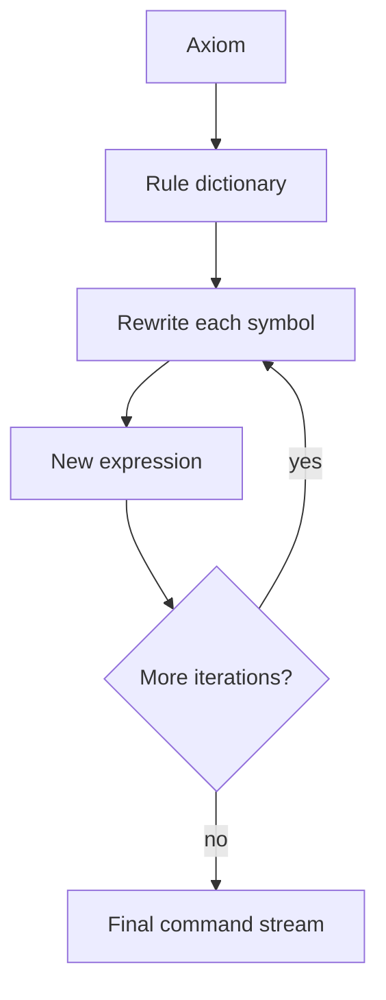
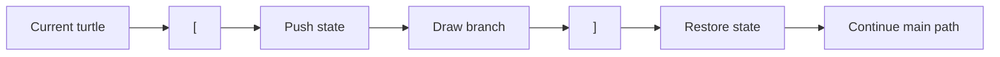

<p align="right">
  <strong>English</strong> | <a href="README.es.md">Espanol</a>
</p>

# Lindenmayer Systems in Clojure

<div align="center">


</div>

---

A deterministic Clojure engine that reads Lindenmayer System definitions, expands them through parallel rewriting rules, interprets the resulting command stream with turtle graphics, and exports the generated geometry as SVG.

## Highlights

> A compact functional pipeline for parsing formal grammars, transforming symbolic state, and rendering deterministic output.

- **Rule-based grammar expansion**: each iteration rewrites the complete expression from an axiom and a map of production rules.
- **Immutable turtle state**: drawing operations transform plain Clojure maps containing coordinates, heading, configured angle, and pen state.
- **Stack-based branching**: `[` and `]` push and restore turtle states, enabling plant-like and recursive fractal structures.
- **SVG generation pipeline**: the interpreter records line segments, computes drawing bounds, creates a dynamic `viewBox`, and writes a portable SVG artifact.
- **Resource-driven examples**: sample `.sl` files define classic L-Systems such as Koch curves, Dragon curve, Sierpinski variants, Peano curve, Levy curve, grids, trees, and other fractal patterns.
- **Backend-relevant design practice**: parsing, data transformation, recursive processing, deterministic execution, file I/O, and command-line orchestration are separated into small functions.

---

## What It Is

This project implements a small L-System processor in Clojure.

An L-System starts with an initial string called an **axiom**. On every iteration, each symbol is rewritten according to a set of production rules. After enough iterations, a short symbolic definition can become a very large command sequence. This project then interprets that sequence using turtle graphics and outputs the result as SVG.

Although the output is visual, the interesting part of the project is the backend-style processing pipeline:

1. Read and parse a structured input file.
2. Convert textual rules into a lookup dictionary.
3. Expand the expression recursively for `n` iterations.
4. Interpret the generated command stream as state transitions.
5. Persist the resulting vector geometry into an SVG file.

---

## Why L-Systems

Lindenmayer Systems are a clean example of how simple rules can produce complex behavior. They are used to model fractals, recursive curves, and biological growth patterns.

That makes them a useful programming exercise because the implementation has to coordinate several concerns at once: parsing, symbolic rewriting, recursion, state modeling, stack behavior, numeric geometry, and deterministic output generation.

---

## Capabilities

### Parallel Rewriting Engine

The core expression expansion is handled by `hallar-expresion` and `hallar-expr-aux`.

- The input expression is processed symbol by symbol.
- If a production rule exists for a symbol, the symbol is replaced.
- If no rule exists, the symbol is preserved.
- The rewritten expression becomes the input for the next iteration.

This mirrors the L-System model where all symbols are conceptually rewritten in parallel during each generation.



### Turtle Graphics Interpreter

The drawing engine uses a turtle represented as an immutable map:

```clojure
{:x 0
 :y 0
 :angulo-cons 90
 :angulo-act 90
 :pluma true}
```

Supported commands:

| Command | Behavior |
| --- | --- |
| `F`, `G` | Move forward and record a visible line segment |
| `f`, `g` | Move forward with the pen lifted |
| `+` | Rotate right by the configured angle |
| `-` | Rotate left by the configured angle |
| `|` | Reverse direction by 180 degrees |
| `[` | Push the current turtle state onto the stack |
| `]` | Restore the previous turtle state from the stack |

The interpreter walks the final command stream recursively and accumulates a history of line segments.

### Branching Structures

Branching is implemented with a stack of turtle states. This is what allows definitions such as tree and plant systems to return to previous positions and continue drawing from there.



### SVG Export

After interpreting the command stream, the project writes SVG line elements from the recorded movement history.

The SVG writer:

- calculates minimum and maximum coordinates from all generated segments;
- derives a `viewBox` from those bounds;
- flips the Y coordinate for SVG rendering;
- appends each movement as a `<line>` element;
- writes the final output to the path provided by the CLI.

### Input File Format

Input files live in `resources/` and use a minimal text format:

```text
<angle>
<axiom>
<symbol> <replacement>
<symbol> <replacement>
...
```

Example from `resources/koch1.sl`:

```text
90
F
F F-F+F+F-F
```

Example from `resources/arbol1.sl`:

```text
25
X
X F+[[X]-X]-F[-FX]+X
F FF
```

---

## Project Structure

```text
.
|-- project.clj
|-- src/
|   `-- algo3_tp2_sistemasl/
|       `-- core.clj
|-- resources/
|   |-- arbol1.sl
|   |-- dragon.sl
|   |-- koch1.sl
|   |-- sier1.sl
|   `-- ...
|-- test/
|   `-- algo3_tp2_sistemasl/
|       `-- core_test.clj
`-- doc/
    `-- intro.md
```

### Main Components

| Area | Functions | Responsibility |
| --- | --- | --- |
| Input processing | `procesar-entrada`, `convertir-reglas-a-diccionario` | Read `.sl` files and parse rules |
| Rewriting | `hallar-expresion`, `hallar-expr-aux` | Generate the final L-System expression |
| Turtle state | `nueva-tortuga`, `adelante`, `derecha`, `izquierda`, `invertir` | Model movement and rotation |
| Branching | `apilar-tortuga`, `desapilar-tortuga` | Save and restore drawing state |
| Rendering | `dibujar`, `detectar-movimiento`, `calcular-limites` | Convert commands into geometry |
| Output | `escribir-svg`, `escribir-svg-wrapper` | Write SVG markup |
| CLI entrypoint | `-main` | Connect input, generation, drawing, and output |

---

## Getting Started

### Requirements

- Java JDK 8+
- Leiningen

### Install

```bash
git clone https://github.com/Vityyy/L-Systems.git
cd L-Systems
```

### Run

The application expects three CLI arguments:

```bash
lein run <input-file> <iterations> <output-svg>
```

Example:

```bash
lein run koch1.sl 4 output.svg
```

The input file is resolved from the `resources/` directory. The SVG output is written to the path passed as the third argument.

### Run the REPL

```bash
lein repl
```

Example REPL usage:

```clojure
(require '[algo3-tp2-sistemasl.core :as ls])

(def rules {:F "F-F+F+F-F"})
(def expression (ls/hallar-expresion "F" rules 3))
(def history (ls/wrap-tortuga 90 expression))

(ls/escribir-svg-wrapper history "koch.svg")
```

---

## Example Systems

The repository includes several ready-to-run definitions:

| File | Pattern |
| --- | --- |
| `koch1.sl`, `koch2.sl`, `koch3.sl` | Koch-style curves |
| `sier1.sl`, `sier2.sl` | Sierpinski-style systems |
| `dragon.sl` | Dragon curve |
| `levy.sl` | Levy curve |
| `peano.sl` | Peano curve |
| `arbol1.sl`, `arbol2.sl`, `arbol3.sl` | Tree and plant-like branching |
| `quad1.sl`, `quad2.sl`, `quad3.sl` | Quadratic patterns |
| `grilla.sl`, `hex.sl`, `penta.sl`, `lakes.sl`, `nieve.sl` | Additional geometric examples |

---

## Technical Notes

- The implementation uses only Clojure `1.11.1` and the standard library.
- Geometry is generated with `Math/cos`, `Math/sin`, and degree-to-radian conversion.
- Movement step size is currently fixed at `15`.
- The starting turtle position is `(0, 0)` with an initial active angle of `90` degrees.
- SVG writing appends to the output file. If the target file already exists, remove it before regenerating to avoid duplicated markup.
- The current test file is still the default generated placeholder and intentionally fails. It should be replaced with real unit tests before treating CI results as meaningful.

---

## Relevant Takeaways

- building a deterministic processing pipeline from input to persisted output;
- transforming unstructured text into structured data;
- modeling domain state explicitly with immutable data structures;
- using recursion for controlled iteration and stream processing;
- separating parsing, business logic, state transition, and output generation;
- keeping the runtime dependency surface small and understandable.

---

## Status

**Complete academic systems project**. The repository is useful as a backend-oriented showcase of low-level data transformation, deterministic logic, command-line orchestration, and clear functional decomposition.

> **Note:** This is not a production graphics engine or full L-System framework. It is a focused academic implementation built to demonstrate parsing, recursive rewriting, immutable state modeling, and deterministic SVG generation in Clojure.

# 🌿 L-Systems in Clojure

<div align="center">
  
  
  
  
</div>

<div align="center">
  
</div>

> **📚 Academic Project Notice**  
> This project was developed during our **third year** of the Computer Engineering program at the University of Buenos Aires. _This repository **does not** reflect our current programming level or professional skills. It is kept here as an academic and knowledge record._

---

## 🤖 About

**L-Systems** is a functional implementation of **Lindenmayer Systems** (L-Systems) coded entirely in **Clojure**. This project explores parallel rewriting systems and formal grammars, demonstrating how simple rules can generate complex fractal patterns and simulate natural growth processes like plant development.

### 🎯 ¿What are L-Systems?
L-Systems are **parallel rewriting systems** that use:
- **🌱 Simple rules** to generate complex structures
- **🔄 Iterative expansion** of symbolic strings
- **🎨 Geometric interpretation** to create visual patterns
- **📐 Mathematical precision** in fractal generation

### 🔧 Technical Features
- **Pure Functional Programming** leveraging Clojure's immutable data structures
- **Parallel String Rewriting** for efficient L-System generation
- **Rule-Based Grammar** system for pattern definition
- **Recursive Pattern Generation** through functional composition

---

## 📋 Prerequisites

- **Java JDK 8+** (required for Clojure runtime)
- **Clojure CLI** tools installed
- **Leiningen** or **deps.edn** for dependency management

---

## 🛠️ Quick Start

### Installation
```bash
# Clone the repository
git clone https://github.com/Vityyy/L-Systems.git
cd L-Systems
```

### Using Leiningen
```bash
# Install dependencies
lein deps

# Run REPL
lein repl

# Run examples
lein run
```

### Using Clojure CLI
```bash
# Run with deps.edn
clj -M:dev

# Start REPL
clj
```

---

## 🌟 Example L-Systems

### 🌿 Classic Patterns
- **Koch Curve** — Fractal snowflake generation
- **Sierpinski Triangle** — Classic recursive triangle
- **Dragon Curve** — Space-filling dragon fractal
- **Plant Growth** — Biological growth simulation

### 🔧 Custom Rules
Define your own L-System rules:
```clojure
;; Example: Simple branching pattern
{:axiom "F"
 :rules {"F" "F[+F]F[-F]F"}}
```

---

## 🧪 Running Examples

### Interactive REPL Session
```clojure
;; Load the L-Systems namespace
(require '[l-systems.core :as ls])

;; Generate a simple L-System
(ls/generate-l-system axiom rules iterations)

;; Visualize patterns
(ls/draw-l-system pattern)
```

### Example Generations
```clojure
;; Koch curve after 3 iterations
(ls/koch-curve 3)

;; Plant growth simulation
(ls/plant-growth 5)
```

---

## 💡 Key Concepts
- **Functional Programming** paradigms and principles
- **Recursive Data Structures** and their manipulation
- **Lazy Sequences** for efficient memory usage
- **Pattern Matching** and rule-based systems
- **Mathematical Modeling and precision** through code in fractal generation
- **Immutable Data Structures** for safe parallel processing

---

## 🔧 Project Structure

```
src/
├── l_systems/
│   ├── core.clj           # Main L-System engine
│   ├── rules.clj          # Rule definitions
│   ├── patterns.clj       # Common L-System patterns
│   └── visualization.clj  # Rendering and display
test/
├── l_systems/
│   └── core_test.clj      # Unit tests
```

---


## 🧪 Testing

Run the test suite:
```bash
lein test
```

---

<div align="center">
  
  
  **Built with 🌿 Clojure & 📐 Mathematics at Universidad de Buenos Aires**
</div>
